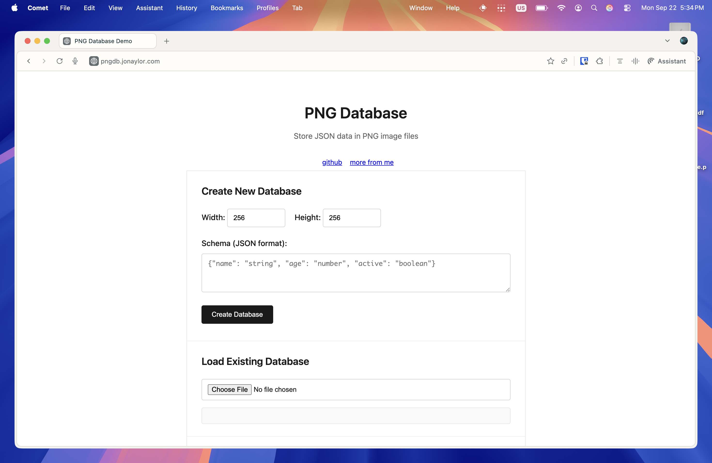

# PNG-DB

A simple database that stores JSON data rows as compressed text within the zTXt chunks of PNG image files. Each JSON row is associated with a pixel coordinate and can be queried using a simple SQL-like syntax.


**Try it online**: [https://pngdb.jonaylor.com](https://pngdb.jonaylor.com)



## Quick Start

```bash
just        # List all available commands
just serve  # Start web demo
just demo   # Try CLI with sample data
```

## Features

- **PNG Storage**: Stores JSON data in PNG zTXt chunks while maintaining a valid image file
- **Schema Definition**: Define field types for your JSON data structure
- **Coordinate-based Storage**: Associate each JSON row with pixel coordinates (x, y)
- **SQL-like Queries**: Query data using WHERE clauses with coordinate and JSON field filtering
- **Compression**: Uses zlib compression for efficient storage of JSON data
- **CLI Interface**: Easy-to-use command-line interface for database operations

## Installation

### CLI Version

**Using Just (recommended):**
```bash
just build  # Build CLI version
just demo   # Create and test sample database
```

### Web Demo
Try the [web demo](web/) to test the PNG database in your browser! The web version is compiled to WebAssembly and runs entirely in the browser.

**Using Just (recommended):**
```bash
just serve  # Build WASM and start server
```

## Usage

### Creating a Database

Create a new PNG database with a schema:

```bash
./target/release/png-db create --file mydb.png --width 500 --height 500 --schema "name:string,age:number,active:boolean"
```

### Inserting Data

Insert JSON data at specific coordinates:

```bash
./target/release/png-db insert --file mydb.png --x 10 --y 20 --data '{"name": "Alice", "age": 30, "active": true}'
./target/release/png-db insert --file mydb.png --x 50 --y 100 --data '{"name": "Bob", "age": 25, "active": false}'
./target/release/png-db insert --file mydb.png --x 200 --y 150 --data '{"name": "Charlie", "age": 35, "active": true}'
```

### Querying Data

Query data using WHERE clauses:

```bash
# Find all active users
./target/release/png-db query --file mydb.png --where-clause "WHERE active = true"

# Find users in a specific coordinate range
./target/release/png-db query --file mydb.png --where-clause "WHERE x > 25 AND y < 200"

# Combine coordinate and data filters
./target/release/png-db query --file mydb.png --where-clause "WHERE x > 10 AND age >= 30"

# Find users by name
./target/release/png-db query --file mydb.png --where-clause 'WHERE name = "Alice"'
```

### Listing All Data

List all rows in the database:

```bash
./target/release/png-db list --file mydb.png
```

## Query Syntax

The query engine supports simple WHERE clauses with the following features:

### Supported Operators
- `=` - Equal
- `!=` - Not equal  
- `>` - Greater than
- `<` - Less than
- `>=` - Greater than or equal
- `<=` - Less than or equal

### Supported Fields
- `x`, `y` - Pixel coordinates (numbers)
- Any field defined in your JSON schema

### Value Types
- **Strings**: Use double quotes, e.g., `name = "Alice"`
- **Numbers**: Integer or float, e.g., `age = 30` or `height = 5.9`
- **Booleans**: `true` or `false`

### Combining Conditions
Use `AND` to combine multiple conditions:
```
WHERE x > 100 AND y < 200 AND active = true AND age >= 25
```

## Examples

### Complete Workflow

```bash
# 1. Create a user database
./target/release/png-db create --file users.png --width 1000 --height 1000 --schema "name:string,email:string,age:number,department:string,active:boolean"

# 2. Add some users
./target/release/png-db insert --file users.png --x 100 --y 200 --data '{"name": "Alice Johnson", "email": "alice@company.com", "age": 28, "department": "Engineering", "active": true}'

./target/release/png-db insert --file users.png --x 250 --y 300 --data '{"name": "Bob Smith", "email": "bob@company.com", "age": 34, "department": "Marketing", "active": true}'

./target/release/png-db insert --file users.png --x 400 --y 150 --data '{"name": "Carol Brown", "email": "carol@company.com", "age": 29, "department": "Engineering", "active": false}'

# 3. Query the data
./target/release/png-db query --file users.png --where-clause 'WHERE department = "Engineering"'

./target/release/png-db query --file users.png --where-clause "WHERE active = true AND age > 30"

./target/release/png-db query --file users.png --where-clause "WHERE x > 200 AND y < 250"

# 4. List all data
./target/release/png-db list --file users.png
```

## Technical Details

### Storage Format

- **PNG Image**: Creates a valid PNG image (black pixels by default)
- **Schema**: Stored in a zTXt chunk with keyword "schema"
- **Data Rows**: Each row stored in a zTXt chunk with keyword "row_x_y" (where x,y are coordinates)
- **Compression**: All text data is compressed using zlib before storage

### File Structure

```
PNG File
├── IHDR chunk (image header)
├── zTXt chunk (keyword: "schema") - Database schema
├── zTXt chunk (keyword: "row_10_20") - JSON data at (10,20)
├── zTXt chunk (keyword: "row_50_100") - JSON data at (50,100)
├── ...
├── IDAT chunks (image data - black pixels)
└── IEND chunk (end marker)
```

## Limitations

- **Query Complexity**: Only supports simple WHERE clauses with AND conditions
- **Data Types**: Limited to JSON-compatible types (string, number, boolean, null)
- **Performance**: Not optimized for large datasets - intended for small to medium data storage
- **Concurrency**: No built-in support for concurrent access
- **Indexing**: No indexing - queries perform linear scans
